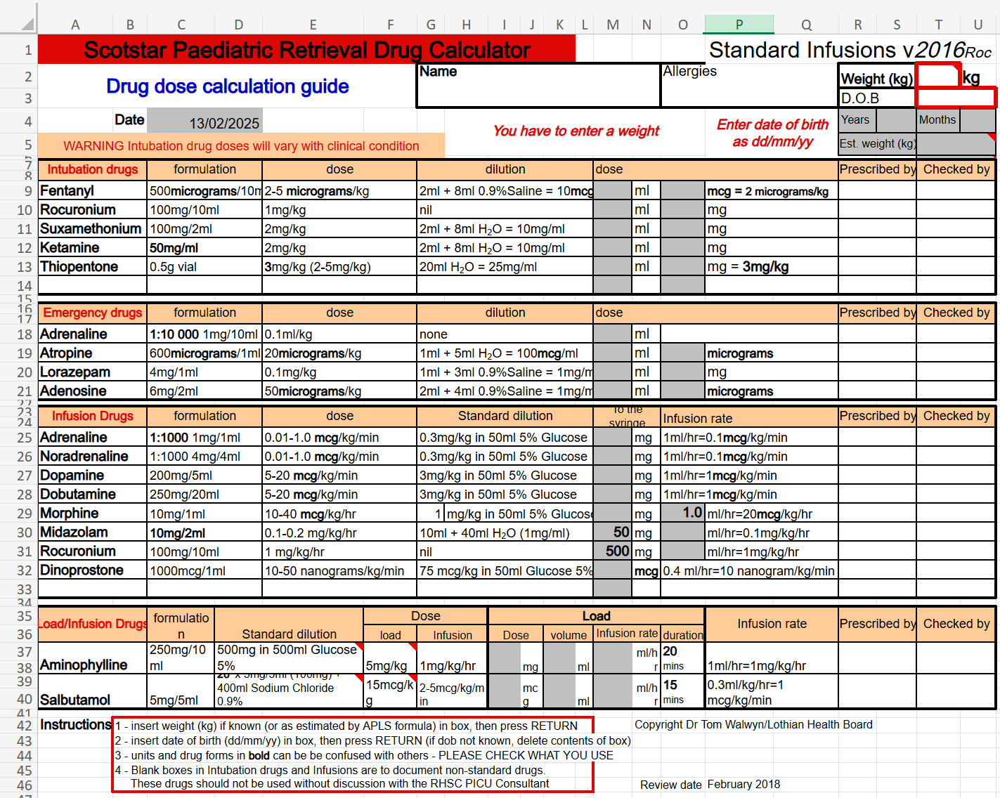

Some computer systems are obviously safety-critical. If you are working on flight-control software for Boeing or Airbus, everyone involved is aware that mistakes in this program could cause loss of life. So software like this is written very, very carefully - extremely detailed specifications, often proofs of correctness using a theorem prover, exhaustive testing, and so on.

But there are also cases where general-purpose software can wind up in a situation where bugs could cause dangerous consequences. I'm using "unofficial safety-critical software" quite loosely to refer to refer to this.

For example, a web search turns up many resources like https://www.snprs.scot.nhs.uk/?page_id=635, which contains an Excel spreadsheet for calculating drug dosages, including for dangerous medications like fentanyl. If there are errors either in the Excel application itself, or in the spreadsheet, it doesn't seem like a stretch to say that could kill a child. It's not surprising that the web page says **"Disclaimer: this drug calculator is intended as an aid to management and must AT ALL TIMES be used in conjunction with local drug preparation, checking and administration policies"**

I don't mean by this to call out either the people who made this calculator, or Microsoft, as having done something wrong. I don't have any firm conclusions at all, but likely this is a lot safer than calculating things by hand.

But it raises some interesting questions.

- Is Excel "unofficial safety-critical software"? Is the spreadsheet itself USCC?
- How about any sufficiently-powerful program, like a programming language or MATLAB, which could be used for life-or-death calculations?
- If calculating dosages in a spreadsheet is too dangerous, what would we recommend instead?
- How do we distribute responsibility for correctness between Excel, the spreadsheet author, and the physician using the spreadsheet? Excel's EULA and the web page disclaimer push the responsibility entirely to the end user. Is that reasonable? 
- Is the software I work on unofficially safety-critical? Should that change my approach?  
